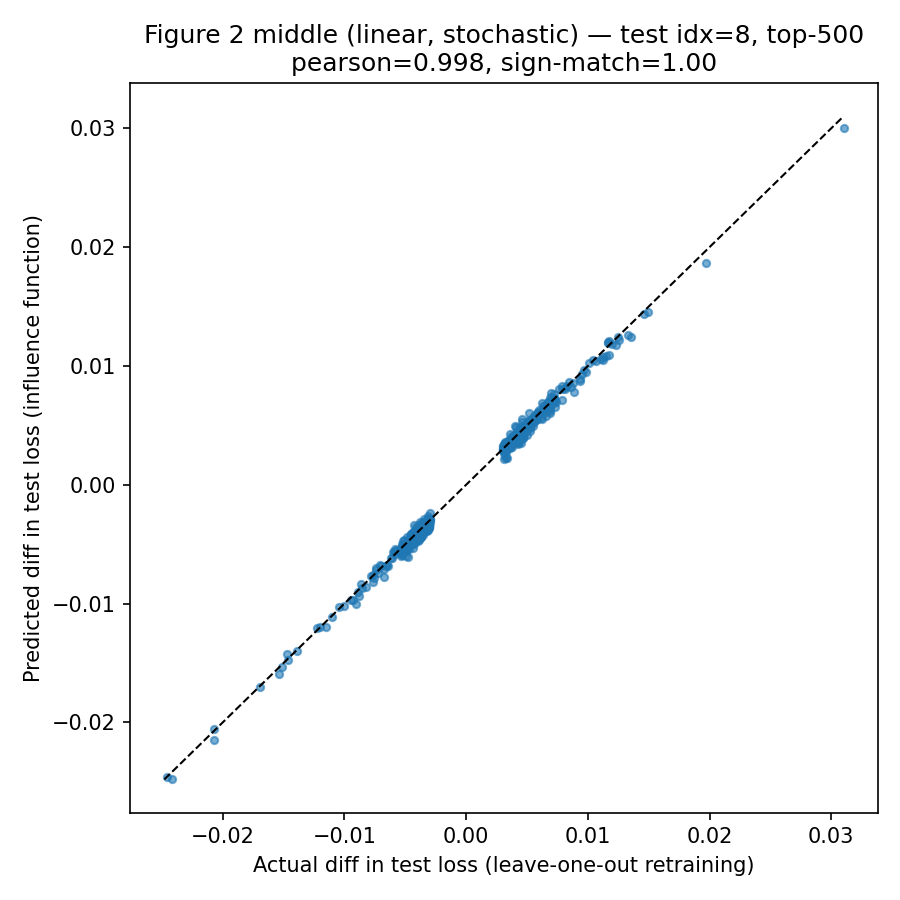

# Replicating Influence Functions (Koh & Liang, 2017)

Replication of the **middle panel of Figure 2** from
Koh, P. W., & Liang, P. (2017).
[Understanding Black-box Predictions via Influence Functions](https://arxiv.org/abs/1703.04730). ICML.

The experiment: on an L2-regularized logistic regression trained on
10-class MNIST (`n = 55,000`, `p = 7,840`), compare the influence-function
prediction of "what happens to the test loss if I remove training point z?"
against the ground truth obtained by actually removing the point and
retraining. Influence is computed via two methods:

- **Conjugate Gradient (CG)** — exact inverse-Hessian-vector product
- **LiSSA** — stochastic Neumann-series approximation (Agarwal, Bullins & Hazan, 2016)

Ground truth is obtained by leave-one-out (LOO) retraining with L-BFGS in
float64.

## Result



| Metric               | Value  |
| -------------------- | ------ |
| Pearson correlation  | 0.9983 |
| Spearman correlation | 0.9890 |
| Same-sign ratio      | 1.0000 |
| Top-K                | 500    |
| Test point           | idx = 8 (a misclassified 5; model predicts 6) |

500 training points were selected by `|CG influence|`; for each of them, the
LiSSA-predicted loss difference (y-axis) is plotted against the actual LOO
loss difference (x-axis).

## Setup

```bash
pip install torch torchvision matplotlib numpy
```

Python 3.9+ recommended. Runs on CPU (the LOO step requires float64, which
Apple MPS does not support — see `loo_retrain_topk.py` for details).

## Pipeline

Each step reads from `outputs/` and writes back to it. MNIST is downloaded
into `data/` by `torchvision` on the first run.

```
python3 train_linear_mnist.py             # 1. Train baseline (writes outputs/linear_mnist_lbfgs.pt)
python3 inspect_test_point.py             # 2. Verify the chosen test point (idx=8)
python3 hvp_sanity_check.py               # 3. (Optional) Sanity-check the HVP implementation
python3 cg_inverse_hvp.py                 # 4a. Compute s_test via Conjugate Gradient
python3 stochastic_inverse_hvp.py         # 4b. Compute s_test via LiSSA
python3 compute_predicted_influence.py    # 5.  Predicted influence for every training point
                                          #     (edit S_TEST_PATH inside to switch CG <-> LiSSA)
python3 loo_retrain_topk.py               # 6.  LOO retrain top-500 and draw the scatter plot
```

Step 6 produces `outputs/loo_scatter_top500_middle_idx8.png` and the
correlation metrics above.

## Files

| File | Role |
| ---- | ---- |
| `influence_utils.py` | Shared utilities (model class, HVP via Pearlmutter's trick, gradient / loss helpers, checkpoint loader) |
| `train_linear_mnist.py` | Train the baseline linear classifier with L-BFGS |
| `inspect_test_point.py` | Pick a misclassified test point (default: idx=8) |
| `hvp_sanity_check.py` | Verify the HVP implementation by checking linearity |
| `cg_inverse_hvp.py` | Conjugate Gradient for `s_test = H^{-1} ∇L(z_test)` |
| `stochastic_inverse_hvp.py` | LiSSA recursion for `s_test` |
| `compute_predicted_influence.py` | Predicted loss-diff for every training point, given `s_test` |
| `loo_retrain_topk.py` | Top-K leave-one-out retraining + scatter plot + correlation metrics |

## Reports

Two writeups in `reports/`, in both Chinese and English:

- `reports/replication_report_zh.tex` / `replication_report_en.tex` —
  This replication: pipeline, the three bugs I hit, results.
- The paper summary is submitted separately.

Compile with pdfLaTeX; the scatter plot is included in the `reports/`
directory so the `.tex` files build standalone.

## Three bugs worth flagging

These are documented in detail in the report; summary for readers of the code:

1. **LiSSA effective regularization**: the recursion
   `h_j = v + (1 − damping)·h_{j−1} − H_z·h_{j−1}/scale` converges in
   expectation to `(H + damping·scale·I)^{-1} v`. So the effective extra
   regularization is `damping × scale`, **not** damping alone. Common
   defaults (`damping=0.01, scale=50`) silently add 0.5 on top of the real
   L2 of 0.01 — 50× too much. This repo uses `damping=0, scale=25`.

2. **CG iteration budget**: with `p = 7,840`, `MAX_CG_ITERS = 30` is far too
   small. This repo uses 200 with early stopping at `tol=1e-8`.

3. **LOO precision**: float32 + default L-BFGS tolerances produce a false
   "actual diff = 0" for many points (the warm-start's initial gradient
   triggers the stopping criterion at iteration 0). This repo uses float64,
   `tolerance_grad=0`, `tolerance_change=0`, strong Wolfe line search.

## Citation

```
Koh, P. W., & Liang, P. (2017).
Understanding black-box predictions via influence functions.
International Conference on Machine Learning (ICML).
```
